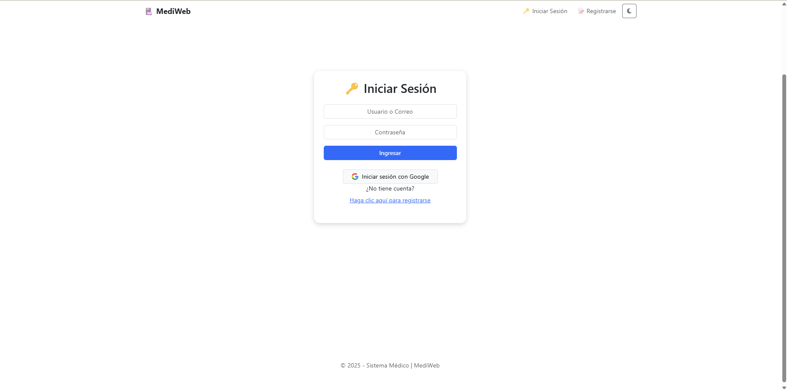
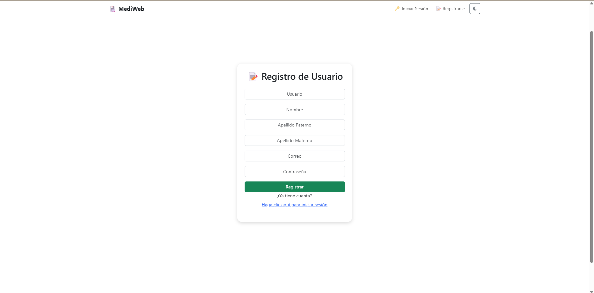

# 🏥 ProyectoSistemaMedico  - Aplicación .NET 9 en Docker 🥼

## 📚 Contenido del repositorio

A continuación mostramos el contenido de este repositorio:

 - [Documentación](Documentación): En la carpeta de Documentación se puede encontrar todos los documentos que fueron solicitados para este proyecto, tales como el de Especificación de Requerimientos, FURPS, Casos de Uso, entre otros.
 - [Capturas](Capturas): En la carpeta de Capturas se encontrarán los archivos de las capturas de pantalla del funcionamiento del proyecto.
 - [Código Fuente](ProyectoISNuevo) En la carpeta ProyectoISNuevo se puede encontrar el códfigo fuente del proyecto y por lo tanto el Dockerfile para la Dockerización del proyecto. A continuación, explicaremos la manera de Dockerizar nuestra aplicación.

## 📝 Dockerizando una aplicación .NET Core 9.0

Este proyecto es una aplicación .NET 9.0 dockerizada, que puede ejecutarse sin necesidad de instalar Visual Studio ni el SDK de .NET en tu máquina. Solo necesitas tener **Docker** instalado.

### 📌 **Requisitos previos**
Antes de empezar, asegúrate de tener:
- [Docker instalado](https://www.docker.com/get-started) en tu computadora.
- Acceso a una terminal (CMD, PowerShell, Git Bash, etc.).
_ VPN por si el firewall tiene bloqueado el puerto 1433 (Caso del IPN)

Credenciales por default:
- Usuario: steven@test.com
- Password: steven
Esta cuenta es de rol: Administrador

---

### 🚀 **1. Construir la imagen Docker**
Ejecuta el siguiente comando en la terminal dentro del directorio donde se encuentra el `Dockerfile`:

```sh
docker build -t proyectosistemamedico .
```

📌 **Explicación**:
- `docker build` → Construye la imagen Docker.
- `-t proyectosistemamedico` → Asigna el nombre `proyectosistemamedico` a la imagen.
- `.` → Indica que el `Dockerfile` está en el directorio actual.

---

### 🚀 **2. Ejecutar el contenedor**
Después de construir la imagen, inicia un contenedor con:

```sh
docker run -d -p 5000:5000 --name sistemamedico_container proyectosistemamedico
```

📌 **Explicación**:
- `docker run` → Crea y ejecuta un nuevo contenedor.
- `-d` → Ejecuta el contenedor en segundo plano (modo *detached*).
- `-p 5000:5000` → Mapea el puerto **5000** del contenedor al **5000** de la máquina host.
- `--name sistemamedico_container` → Asigna el nombre `sistemamedico_container` al contenedor.
- `proyectosistemamedico` → Es el nombre de la imagen creada en el paso anterior.

---

### 🚀 **3. Verificar que el contenedor está corriendo**
Para asegurarte de que el contenedor se está ejecutando, usa:

```sh
docker ps
```

Si ves `sistemamedico_container` en la lista, ¡la aplicación está corriendo! 🎉

---

### 🚀 **4. Acceder a la aplicación**
Abre tu navegador y visita:

```
http://localhost:5000
```


### 🚀 **5. Ver logs del contenedor**
Si quieres ver lo que está sucediendo en la aplicación en tiempo real:

```sh
docker logs -f sistemamedico_container
```

---

### 🚀 **6. Detener y eliminar el contenedor**
Si necesitas detener el contenedor:

```sh
docker stop sistemamedico_container
```

Si luego quieres eliminarlo:

```sh
docker rm sistemamedico_container
```

---

### 🚀 **7. Eliminar la imagen (opcional)**
Si deseas eliminar la imagen para reconstruirla desde cero:

```sh
docker rmi proyectosistemamedico
```

---

### ✅ **Resumen rápido de comandos**
```sh
# 1. Construir la imagen
docker build -t proyectosistemamedico .

# 2. Ejecutar el contenedor
docker run -d -p 5000:5000 --name sistemamedico_container proyectosistemamedico

# 3. Verificar que el contenedor está corriendo
docker ps

# 4. Ver logs del contenedor
docker logs -f sistemamedico_container

# 5. Detener el contenedor
docker stop sistemamedico_container

# 6. Eliminar el contenedor
docker rm sistemamedico_container

# 7. Eliminar la imagen (opcional)
docker rmi proyectosistemamedico

```

---

## 📸 Funcionamiento del Proyecto

Una vez que el proyecto esté corriendo, la aplicación se verá de la siguiente manera:

 - Página Principal: 
 - Login: 
 - Registro: 
 - Inicio de Usuario: 
 - Inicio de Doctor: 
 - Inicio de Administrador: 
 - Perfil: 
